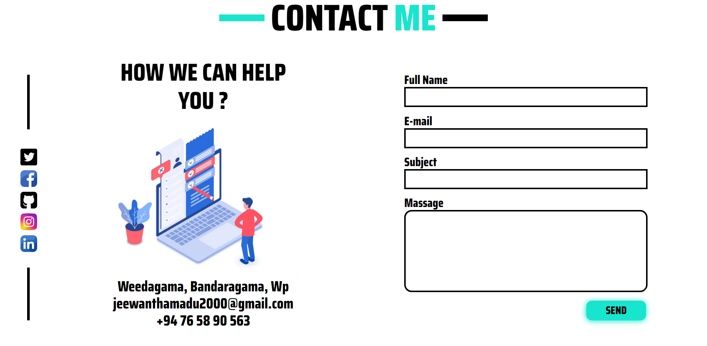

**<h1>SiteMap Of My Profile</h1>**

**<h1> Wireframe Of My Profile</h1>**
  **Home frame**
  
- **About frame**
  

- **Education & Experience frame**
  

- **My Skills frame**
  

- **My Projects & Activities frame**
  

- **Contact With Me & Footer frame**
  

**<h1>Overview Of My Profile</h1>**

- **Home Section**
  
- **About Section**
  
  
- **Education & Experience Section**
  

- **My Skills Section**
  

- **My Projects & Activities Section**
  

- **Contact With Me & Footer Section**
  
  

 **<h1>Links : </h1>**
- Website : 
- GitHub : [Click Here](https://github.com/jeewanthamadu/MyProfile)
- Site Map : [Click Here](https://www.gloomaps.com/kbnEmoCXoG)
- Wireframe : [Click Here](https://wireframe.cc/GQPEMv)
- Mockup : [Click Here](https://www.figma.com/proto/EycC22uov4pPJUePaJPwFe/Untitled?node-id=1%3A2&starting-point-node-id=1%3A2)